# FoodTracker: AI-Powered Nutrition & Health Ecosystem


**FoodTracker** is a premium, fully native iOS nutrition and lifestyle application. It moves beyond basic calorie counting by leveraging **Multi-modal Generative AI (Gemini 2.5 Flash)**, **Computer Vision**, and **Biometric Data** to serve as your ultimate digital nutritionist.

🔗 **Part of a unified ecosystem:** FoodTracker shares an App Group and deep synchronization with its sister application, [WorkoutTracker](https://github.com/Borisserz/WorkoutTracker). Together, they provide a flawless, real-time 360-degree ecosystem where your intense workouts dynamically adjust your daily macro and calorie targets.

---

## 📸 Application Gallery

<table align="center">
  <tr>
    <td align="center"><b>Dashboard & Daily Energy</b></td>
    <td align="center"><b>Smart Search & AI Scanner</b></td>
    <td align="center"><b>Macro Adjustments & Portions</b></td>
  </tr>
  <tr>
    <td>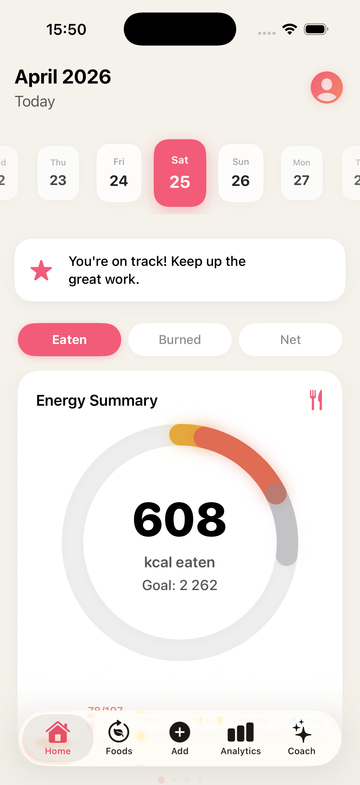</td>
    <td>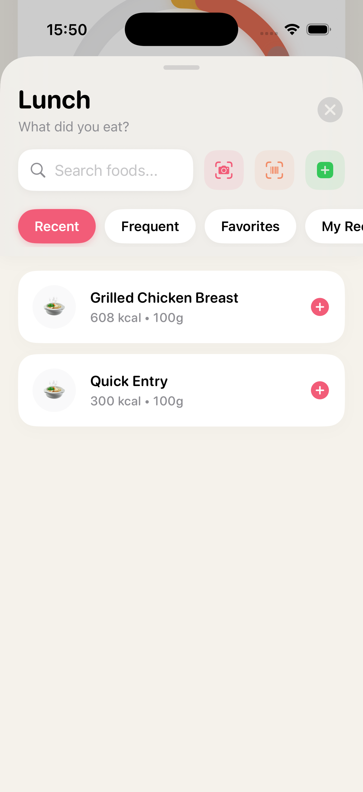</td>
    <td>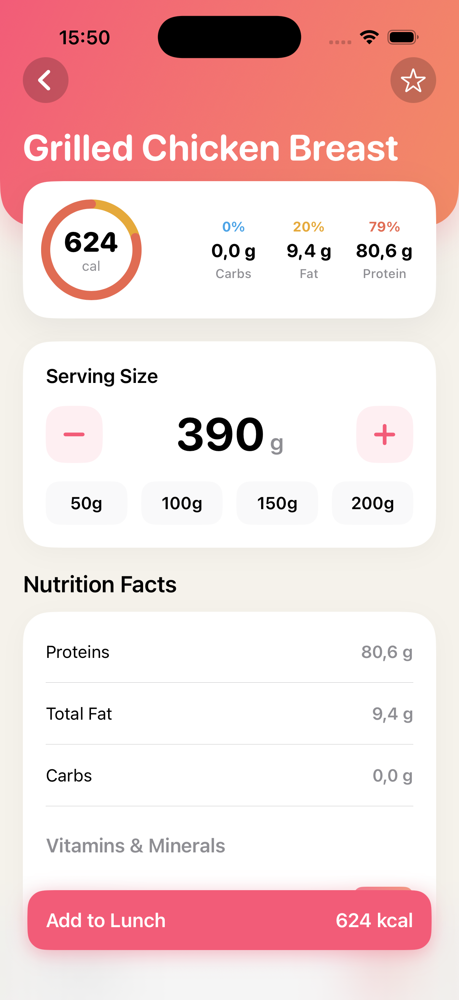</td>
  </tr>
  <tr>
    <td align="center"><b>Diet Architect</b></td>
    <td align="center"><b>Physiological Fasting</b></td>
    <td align="center"><b>Burned vs. Eaten Analytics</b></td>
  </tr>
  <tr>
    <td>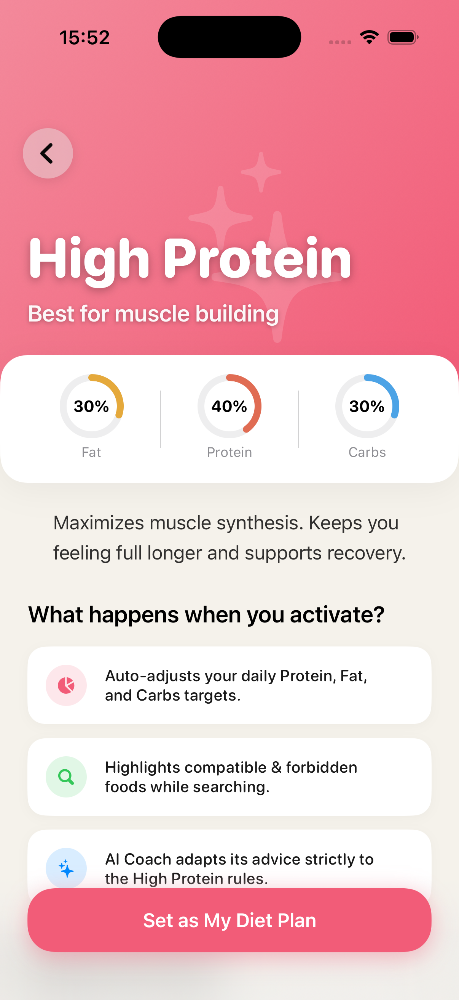</td>
    <td>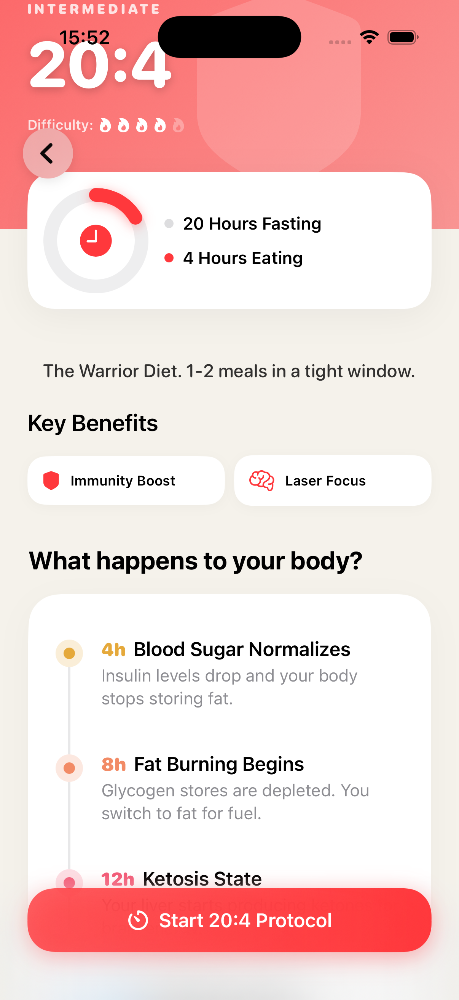</td>
    <td>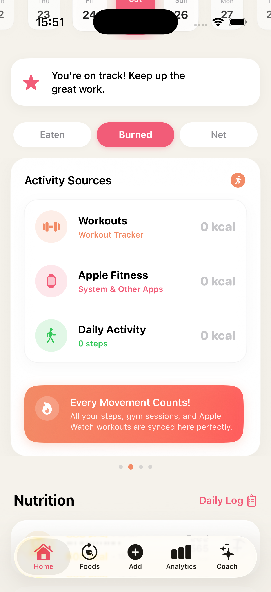</td>
  </tr>
  <tr>
    <td align="center"><b>Advanced Nutrition Radar</b></td>
    <td align="center"><b>Explore & History</b></td>
    <td align="center"><b>Premium Recipes Hub</b></td>
  </tr>
  <tr>
    <td>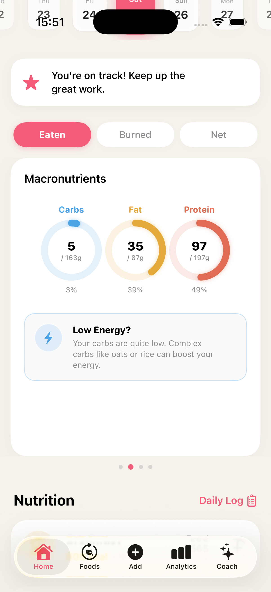</td>
    <td>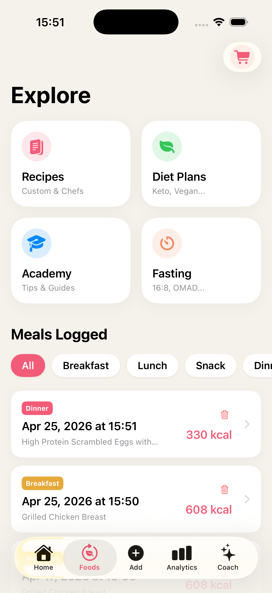</td>
    <td>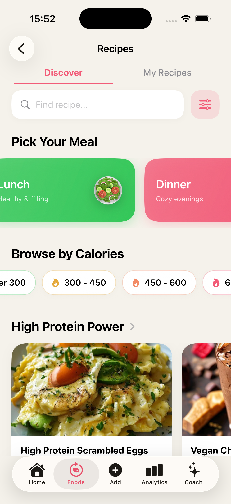</td>
  </tr>
  <tr>
    <td align="center"><b>Proactive AI Coach</b></td>
    <td align="center"><b>Dynamic Macro Setup</b></td>
    <td align="center"><b>Gamification & Profile</b></td>
  </tr>
  <tr>
    <td>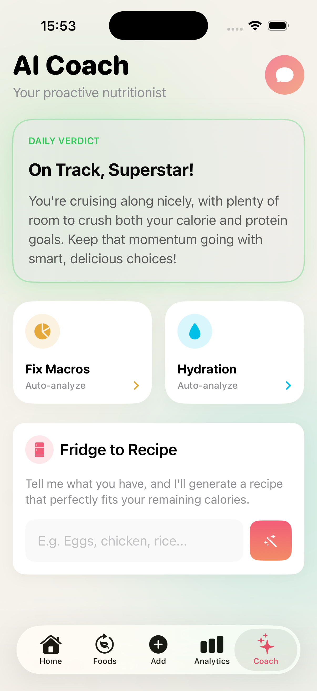</td>
    <td>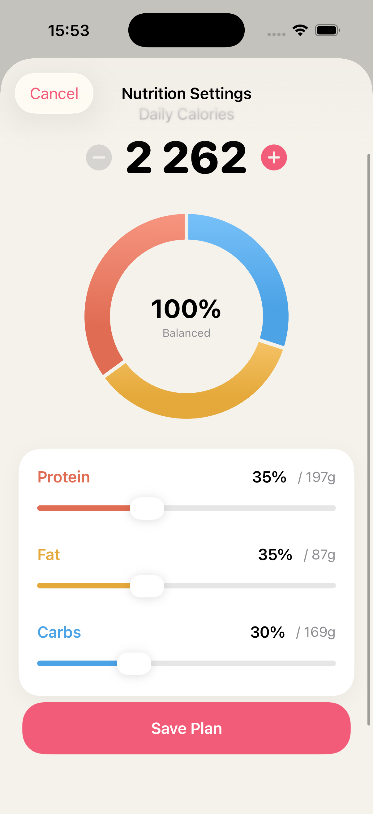</td>
    <td>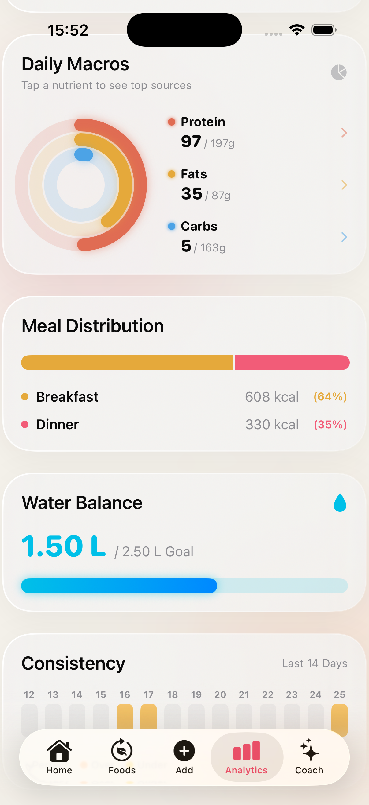</td>
  </tr>
</table>

---

## 🌟 Core Features

### 👁️ Multi-Modal AI Vision (Meal & Menu Hacker)

- **AI Meal Scanner:** Point your custom `AVFoundation` camera at any plate. The Vertex AI model instantly identifies the dish, estimates its weight in grams, and reverse-engineers the exact Calories, Protein, Fats, and Carbs.
- **Restaurant Menu Hacker:** Unsure what to order? Snap a photo of a restaurant menu. The AI cross-references the menu with your _remaining daily macros_ and suggests 3 options: an **Ideal** match, a **Caution** dish, and an absolute **Avoid**.
- **Live Barcode Scanning:** Ultra-fast scanning using Apple's native `DataScannerViewController` (VisionKit), querying the global OpenFoodFacts and FatSecret databases.

### 🧠 Generative AI Nutrition Coach (Google Vertex AI)

- **Context-Aware Chat:** A proactive AI coach that natively knows your weight, today's caloric deficit, and your active diet plan (e.g., Keto, Vegan). It adjusts its advice strictly based on your lifestyle.
- **Fridge-to-Recipe Engine:** Type what ingredients you have left in your fridge. The AI will generate a custom recipe formatted specifically to fill your missing macros for the day.
- **Auto-Fixer:** One tap analyzes your day and provides actionable advice on exactly what snacks to eat to perfectly hit your protein and hydration targets.

### ⚡ Ecosystem Synergy & Biometric Sync

- **WorkoutTracker Integration:** Shares a secure `App Group` container with the WorkoutTracker app. Calories burned during weightlifting or cardio are seamlessly added to your daily allowance in FoodTracker.
- **HealthKit Two-Way Sync:** Automatically pulls Steps, Resting Energy, and Active Energy from Apple Watch. Concurrently writes your logged water intake and consumed dietary energy back to Apple Health.
- **Dynamic Energy Equation:** The dashboard calculates your true "Net Calories" (Eaten – Burned) and projects real-time weight loss/gain forecasts based on your 7-day trend.

### 🧬 Advanced Diets, Fasting & Deep Nutrition

- **Physiological Fasting Tracker:** Tracks your fasts (16:8, OMAD, Alternate Day) and visually displays your current physiological state (Blood Sugar Normalization, Fat Burning, Ketosis, Deep Autophagy). Uses offline `UserNotifications` to alert you when entering a new metabolic phase.
- **Deep Micronutrient Tracking:** Goes beyond simple Macros (Protein/Fat/Carbs) by dynamically calculating Omega-3, Potassium, Magnesium, Iron, Calcium, and Vitamins C & D for every meal.
- **Smart Diet Plans:** Choose plans like High Protein, Mediterranean, or Keto. The app recalculates your macro pie charts instantly and color-codes food searches (Perfect Match ✅ vs. Avoid ❌) based on your active diet rules.

### 📚 Education, Planning & Mindfulness

- **Nutrition Academy:** A built-in educational hub rendering rich Markdown (`AttributedString(markdown:)`) articles to build healthy habits, complete with read-progress tracking.
- **Mindful Eating Journal:** Track your daily emotional relationship with food using the Emoji-based Mood Journal and daily notes.
- **Smart Shopping List:** Seamlessly export missing ingredients from any premium or custom recipe directly into a SwiftData-backed digital grocery list.

### 📊 Deep Analytics & UI/UX Magic

- **Glassmorphism & Fluid Animations:** Built with custom ViewModifiers, Ultra-Premium Card Styles, and reactive spring animations.
- **Interactive Water Grid:** A beautifully animated 3D liquid grid system for tracking hydration incrementally.
- **Consistency Heatmap:** A GitHub-style contribution graph visualizes your diet consistency over the last 14 days (Perfect, Under, Over).
- **Holographic Achievements:** Earn milestone badges that react to device motion using 3D Rotation and Parallax rendering effects.

---

## 🛠 Technical Architecture

This project is built for scale, speed, and safety, utilizing the absolute latest APIs provided by Apple.

- **UI/UX Framework:** 100% `SwiftUI`. Advanced use of `Layout` protocols, `matchedGeometryEffect`, and native `Swift Charts` for data visualization.
- **Data Persistence:** Powered by Apple's modern `SwiftData` framework. Models are strongly typed, relationships are cascaded, and background thread handling prevents UI stuttering.
- **AI Backend:** Custom implementation of Google Cloud's `Vertex AI`. Features a standalone JWT Token Signer (`JWTSigner`) built from scratch in Swift to generate secure Access Tokens without relying on heavy third-party Firebase SDKs.
- **Hardware Integration:** Custom camera pipelines using `AVFoundation` (`AVCaptureSession`) for snapping menu/meal photos optimized for AI processing.
- **State Management:** Fully migrated to Apple's `@Observable` macro architecture, replacing legacy `Combine` and `@StateObject` patterns for minimal memory footprint.
- **Smart Dual-API Fallback:** Network manager intelligently cascades database searches: it first hits the open-source `OpenFoodFacts` API, and if results are scarce, seamlessly falls back to OAuth 2.0 authorized `FatSecret` REST API.

---

## 🚀 Installation & Setup

To compile and run this project, you will need **macOS Sonoma/Sequoia** and **Xcode 15.0+** (iOS 17.0+ Simulator or Physical Device required for VisionKit and SwiftData).

1. **Clone the repository:**

   ```bash
   git clone https://github.com/Borisserz/FoodTracker.git
   ```

2. **Configure AI & Database Credentials:**
   You must provide your own API keys for the app to function fully.
   - **Vertex AI:** Place your Google Cloud Service Account JSON file named `vertex_credentials.json` inside the `App/` directory.
   - **FatSecret API:** Insert your Client ID and Secret directly into `NetworkManager.swift`:
     ```swift
     private let fatSecretClientId = "YOUR_CLIENT_ID"
     private let fatSecretClientSecret = "YOUR_CLIENT_SECRET"
     ```

3. **Configure App Groups (Critical for Sync):**
   Open `FoodTracker.xcodeproj`. Navigate to _Signing & Capabilities_. Under **App Groups**, ensure the identifier (e.g., `group.com.yourname.WorkoutTracker`) matches your Apple Developer portal and the setup used in the sister app.

4. **Build and Run:**
   Select a physical iPhone (required for Camera/Barcode testing and full Apple Health integration) and press `Cmd + R`.

---

## 🔒 Privacy & Health Data

FoodTracker operates on a privacy-first model:

- **No Cloud Storage for Health Data:** All biometric data, food logs, and custom recipes are stored locally via SwiftData and Apple Health.
- **Secure Processing:** Image buffers sent to Vertex AI for the _Meal Scanner_ are compressed and transient. They are not saved to the camera roll unless explicitly exported by the user.

---

## 📜 License & Copyright

Copyright (c) 2026 [Boris Serzhanovich]. All rights reserved.

This project is showcased for **portfolio and demonstration purposes only**. The source code, AI prompt engineering logic, UI designs, and custom algorithms are proprietary. They are not licensed for public, commercial use, redistribution, or modification without explicit written permission from the author.
