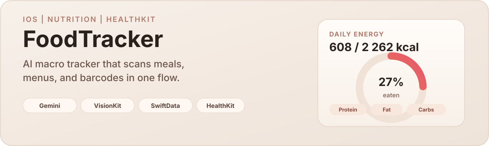
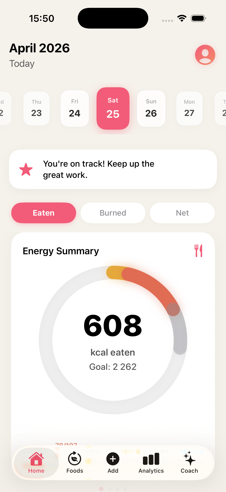
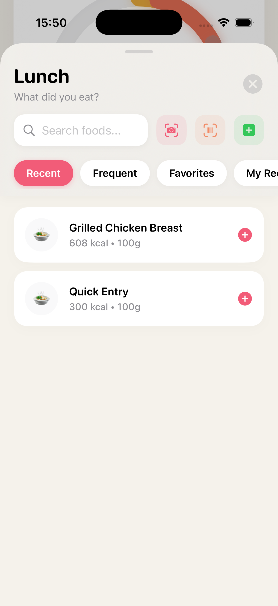
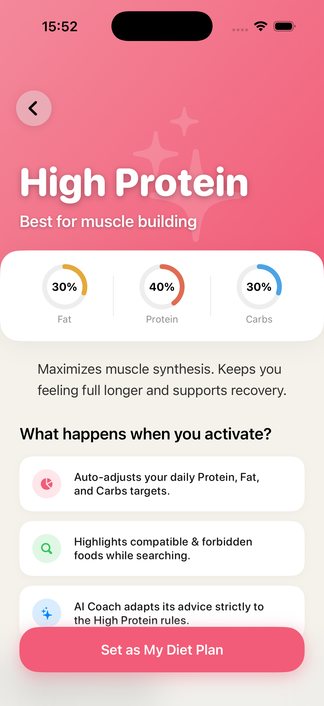
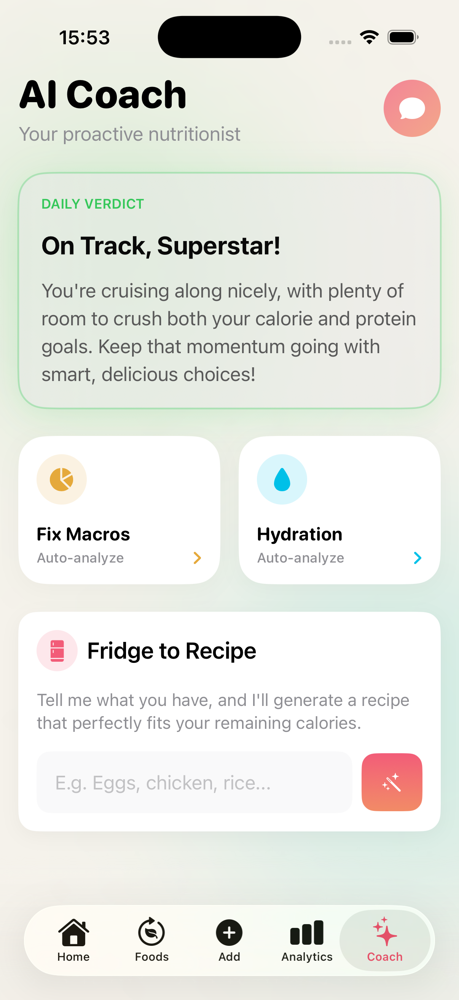

<p align="center">
  
</p>

<p align="center">
  <a href="https://apps.apple.com/us/app/foodtracker-ai-macro-tracker/id6778506345">
    
  </a>
</p>

<p align="center">
  <a href="https://apps.apple.com/us/app/foodtracker-ai-macro-tracker/id6778506345"><strong>App Store</strong></a>
  ·
  <a href="https://github.com/Borisserz/WorkoutTracker">WorkoutTracker</a>
  ·
  <a href="https://apps.apple.com/us/developer/barys-serzhanovich/id6774895109">Developer</a>
</p>

**FoodTracker** is a native iOS nutrition app: multimodal Gemini for meal and menu photos, barcode search, macros/micros, fasting, and HealthKit sync with WorkoutTracker.

---

## Screenshots

<p align="center">
  
  
  
  
</p>

---

## What it does

| Area | What you get |
| --- | --- |
| **Logging** | Search, VisionKit barcodes (OpenFoodFacts → FatSecret fallback), AI plate scan with gram + macro estimates |
| **Menu helper** | Photo a restaurant menu; get Ideal / Caution / Avoid picks against remaining macros |
| **Coach** | Context-aware chat, fridge-to-recipe, one-tap day auto-fix for protein and hydration |
| **Physiology** | Diet plans, micronutrients, fasting phases with offline notifications |
| **Ecosystem** | App Group `group.com.borisdev.WorkoutTracker` + HealthKit two-way sync with [WorkoutTracker](https://github.com/Borisserz/WorkoutTracker) |

Health logs stay on-device (SwiftData + Apple Health). Images sent for meal scan are transient.

---

## Stack

`SwiftUI` · `SwiftData` · `Observation` · `AVFoundation` · `VisionKit` · `HealthKit` · `Swift Charts` · Vertex AI / Gemini · OpenFoodFacts · FatSecret

---

## Build locally

Requires **Xcode 15+**, **iOS 17+** (device recommended for camera / Health).

```bash
git clone https://github.com/Borisserz/FoodTracker.git
cd FoodTracker
```

1. AI calls go through the project’s Gemini/Vertex **Cloud Functions proxy** (`GeminiProxyClient`). Point it at your own endpoint or keep the shipped one for portfolio builds.
2. FatSecret credentials are loaded from **Firebase Remote Config** (`fatsecret_client_id` / `fatsecret_secret`) — configure those keys in your Firebase project.
3. Match App Group `group.com.borisdev.WorkoutTracker` with WorkoutTracker (or your own shared group).
4. Run on a physical iPhone (`Cmd+R`).

---

## License

Copyright (c) 2026 Boris Serzhanovich. All rights reserved.

Portfolio / demonstration only. Source, prompts, UI, and algorithms are proprietary — no public commercial use, redistribution, or modification without written permission.
